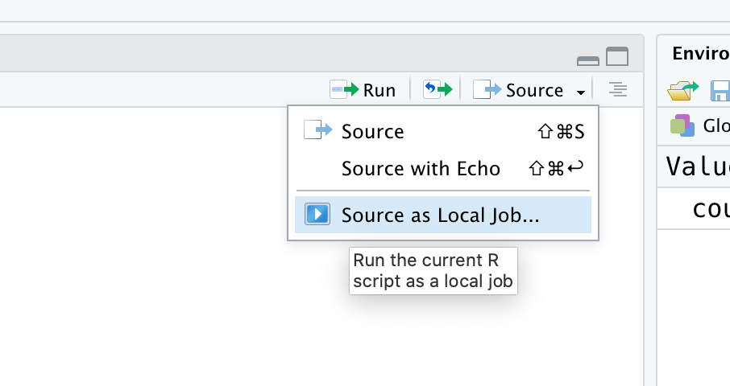
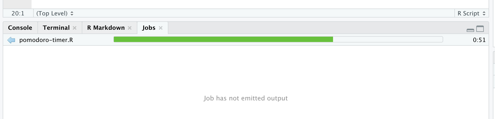

## There's an R package for that!

One of R's strengths is the vast amount of 3rd party code--packages--that can expand its functionality. There are over 15.000 packages on [CRAN](https://cran.r-project.org/), R's beloved package repository, and many more packages can be found on GitHub, Bioconductor, Neuroconductor, etc.

This series of blog post is meant to unearth some of the lesser known gems: Packages that solve a very specific, perhaps obscure, problem. Packages that will make your life easier or make you scratch your head in wonder. Packages that are useful and packages that are just weird. We will have a look around the ginormous toolshed that is the R package ecosystem. Each episode will highlight another package, the power of R, and its amazing community.

***

## Make R scream with "beepr"

Today we will look at packages that let R play notification sounds. This way R can notify you when your calculations are finished or have crashed, so you don't have to continuously check on it and can instead ~~browse Reddit~~ read research papers.

The `beepr` package is a straightforward way to make R play a sound. Here's how to install the package and play a sound:

```python
install.packages("beepr")
library(beepr)

Sys.sleep(3) # replace this with your time-consuming calculation...
beep()
```

You can change the default "ping" sound to one of 9 alternatives, including the infamous [Wilhelm scream](https://en.wikipedia.org/wiki/Wilhelm_scream).

```python
beep(sound = "wilhelm")
```

`beepr` can also notify you when R throws an error. Just wrap your error-prone code in the `beep_on_error()` function like this:

```python
beep_on_error(stop('I made a huge mistake!'))
```

### Make a Pomodoro timer with beepr

We can use beepr to build ourselves a rudimentary [Pomodoro timer](https://en.wikipedia.org/wiki/Pomodoro_Technique). Create a new R script `pomodoro_timer.R` and add the following code (I'm assuming you are using RStudio, otherwise the notification dialog will not work).

```python
library(beepr) 

counter = 0 # amount of finished pomodoros

while(TRUE) {
  # 25 minutes work
  Sys.sleep(60 * 25)
  counter <- counter + 1
  beep(sound="mario")
  rstudioapi::showDialog("Pomodoro timer",
    sprintf("Pomodoro  nr. %i finished! Time to take a break!", counter))
  
  # 5 minutes break, every 4th break is 15 minute long
  break_dur <- ifelse(counter %% 4, 5, 15)
  Sys.sleep(60 * break_dur)
  beep(sound="wilhelm")
  rstudioapi::showDialog("Pomodoro timer", "Time to get back to work!")
}
```

Of course, the `sleep()` function will block your R session. To run the code as a background process instead, you can use [RStudio's jobs API](https://blog.rstudio.com/2019/03/14/rstudio-1-2-jobs/). Just run `rstudioapi::jobRunScript('./pomodoro-timer.R')` or source the `pomodoro-timer.R` script using the 'Source as local job' button in the top right corner of the source panel.

The job should appear in RStudio's jobs panel, run in the background and remind you when it's time to take a break.





You can learn more about `beepr` [here](https://github.com/rasmusab/beepr).

## Play rapper ad-libs with "BRRR"

The `BRRR` package's main (and only?) function `skrrrahh()` plays sound bites from different rappers. There are 52 different ad-libs for all sorts of situations. To use the package run this:

```python
if(!require(devtools)) {install.packages("devtools")}
devtools::install_github("brooke-watson/BRRR")
library("BRRR")

skrrrahh("kendrick")
```

To have your favourite artists cheer you on while you are coding, run the following code as an RStudio background job like we did above:

```python
while (TRUE) {
  Sys.sleep(sample(5:60)) # randomly pause 5-60 seconds between cheers
  skrrrahh(-1) # a non-existing number will produce a random ad-lib
}
```

You can learn more about `BRRR` [here](https://github.com/brooke-watson/BRRR).

## Look ma, no hands!

If you are on a Mac you can make R rap without any packages at all. Simply use the operating system's built-in text-to-speech engine:

```python
system("say And if you don\\'t know, now you know!") 
# note the double-backslash needed to escaope the special character
```

***

Has Biggie become an integral part of your analysis workflow or do you know other packages that can make R sing, dance, or swallow a sword? Tell me about it! [@drtobilotti](https://twitter.com/drtobilotti)

_Photo by Clem Onojeghuo on Unsplash_