### Try the interactive visualization at [teebusch.github.io/park-vis](https://teebusch.github.io/park-vis) 

(please allow some time for it to load)

***

In 2018, I took a semester-long course on data visualization at KU Leuven. It was a course from the statistics Master's program, taught by Prof. Jan Aerts. The class was project-based and had less than a dozen students and 3 TAs, so it was an intense and hands-on learning experience. We worked with a fairly large data set--more than 1 GB of data--of people's movements around an amusement park and were free to find our own apporach to visualising it.

In class we used [P5.js](https://p5js.org/) - a Java Script implementation of the [Processing](https://processing.org/) language.  However, after some sketching and data exploration with R and some prototyping with Shiny, I decided to use [D3.js](https://d3js.org/) to build the final visualisation. It was a great opportunity to take a deep dive into D3, and I learned quite a lot.

For the course I documented my design process as a series of posts on Medium. I've copied them all here and you can find them below.

*** 

## A First Look at the Data

The assignments revolve around a
data set of visitor movements in a theme park. In this (simulated) theme park, each visitor’s position is captured once a second. When they check in at a location, this is captured, too. We work with the visitor data from one weekend — Friday to Sunday. There are over 26 million records in the data set, from 3500 (Friday) to 7500 (Sunday) unique visitors per day. There is also evidence of a mysterious crime in the data, but that’s for another blog post. The first assignment is to explore the data. Here are some of my insights and thoughts on the data…

### Duration of Visit

Most visitors arrived before 10am and **75% of visitors stayed for at least 12 hours.** The longest stay was just short of 15 hours (which is almost the maximum, given the opening hours, 8am to 11.30pm). The shortest stay was just 10 minutes long (what happened there?).

### Movements and Check-Ins

The park has a number of locations at which visitors can *"check in"*. Many of these are rides (such as rollercoasters). **An average visitor checks in at around 20 locations.** It seems that on the day where the least visitors came to the park, Friday, the average number of check-ins was higher (23) than on Saturday and Sunday (17 and 18, respectively). There are a few visitors with just a single check-in — their entry into the park? — and two with 61 check-ins. The average number of *unique* locations a visitor checks in at is 12–15. Once they check-in at a location, visitors stay for around 7 minutes (Median).

We can plot the **accumulated time** that visitors have spent in each 5x5 meter grid of the park (“movements”) and at each check-in location.

Although the plot does not show whether there are more people in a given area, or people just stay longer, it’s obvious that **not all areas are equally frequented.** This may be the case because there is a a foodcourt, a resting space, or a particularly fun-to-watch attraction. Visitors don’t necessarily spend more time in a spot because they want to. Congested areas are just harder to pass through.

Looking at this I wonder…

- Do people move slower on days/times when there are more visitors? Do they move slower when there are many other people close-by?
- Are there areas where movements are particularly slow? If so, why?

It’s also clear that **some check-in locations are more popular than others.** Some interesting question come to mind:

- Which locations are the most popular? At different times of the day? At different “phases” of the visit? For shorter / longer visits?
- Which rides are taken multiple times by the same person? Are they taken consecutively? Throughout the day?
- Do people take longer at a check-in location depending on the number of visitors in the park / the number of visitors that are close-by? That is, can we see waiting times change?
- Are there locations that people skip more than others, i.e. where people walk by without checking in? Does the *“skip-rate”* depend on the number of visitors queueing for it, the time of the day…?
- How many people does each location “service” per unit time?
- At which rate does each visitor check in to rides. Do people get slower/faster over time? Do some people have a higher frequency than others?

### Differences between days

We can also plot the **most frequented areas and check-in locations for each day and time.** I don’t see any striking irregularities on any of the days. This is a bit unexpected, since there was a major incident in the park on one of the days, and I would expect this to be visible. I may be looking at the data in the wrong way.

  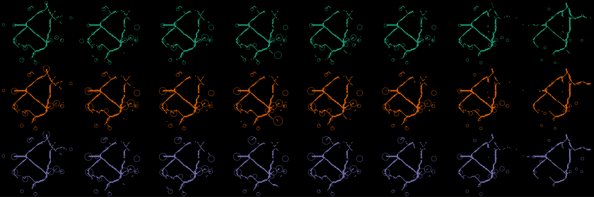

### Paths

If we plot some individual visitors’ path through the park we can see that there are typical patterns as well as individual differences.

  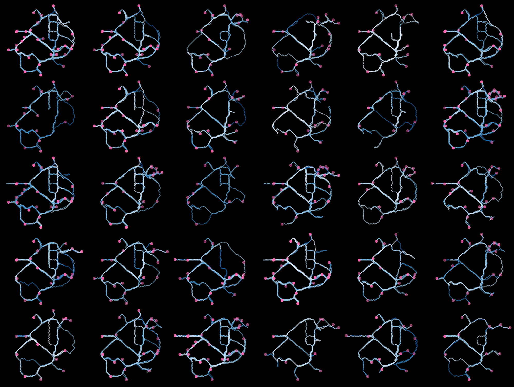

Again, some questions come to mind:

- What does the typical *“flow”* of visitors through the park look like? Do people just go through the rides in the order they encounter them or do they take more complex paths? Are there particularly common sequences?
- Does it make sense to model check-in sequences as Markov chains, or check-in frequencies as Poisson distributed, so we can identify unusual behaviour?
- Are there peak times throughout the day? At particular rides?
- Can we identify people who move in groups? Does group size affect behaviour (number of rides taken, duration of pauses, length of stay)? If groups split, why, for how long, and where do they reunite?
- Are there clusters regarding which areas of the park people go to? E.g. rollercoaster-maniacs, water-freaks, foodcourt-chillers, families hanging out in kiddie-land all day…?
- Can we see people resting? When and where do visitors rest?

This is a simulated data set, so not all of these questions may have interesting answers, but it will still be fun to investigate them further. I’m running of time, so I will have to leave them open for now.

## Understanding the Data Structure - Who, When, Where, What?

The next step towards visualizing the park data is to specify the **“data structure”**. In the *Methodical Exploration of Design Space (MEDS)* framework, this exercise helps to expand the “Design space that you know” to cover more of the “Design space that exists”. 

In computer science different data structures lend themselves to different operations: Elements in an array can be accessed directly via their index, but removing a random element is computationally expensive. Elements of a linked list can be removed easily, but to find the *n*th element, one must visit all *n-1* preceeding elements. Although the two concepts are not identical, identifying the data structure of the park data set should in a similar way help to reveal units of observation, relationships, derivative variables, and possible operations.

My starting point for figuring out the data structure was to think about the available observational units and their features. Then I sketched the data structure. I tried to incorporate the aspects I had thought about, while keeping an open mind for connections my brain would make as I was drawing. Here’s what came out of that:

### Locations and Attractions

Locations are small parts of the park (5x5m tiles). Each tile has up to eight neighbouring tiles. Not all xy-coordinates represent accessible tiles, but all accessible tiles are connected. One can [find](https://en.wikipedia.org/wiki/Dijkstra%27s_algorithm#/) the shortest **path** between any two locations (finding the longest path [is not as easy](https://en.wikipedia.org/wiki/Longest_path_problem)). Moving from one location to another will take some amount of time and likely depends on factors such as the number of visitors in the location, the direction one is heading, the speed at which one is moving…). There will be some number of visitors at a location at any time.

Some locations are **attractions** that visitors check into, spend time at, and then leave again. Attractions belong to certain **categories** (water slides, thrill rides, stage shows…), that will make them more or less attractive to different visitors. Even within a category their popularity may vary. At a given moment in time, there will be some number of visitors checked in at an attraction. 

**Using an attraction** will normally take a more or less constant amount of time. However, attractions can only serve a certain number of visitors per unit time. If that number is exceeded, visitors will have to queue, i.e. spend more time “checked-in”, or even wait outside, not checked in. 

Attractions may be **closed down** and inaccessible to visitors during certain times, like when there is no show at a stage (…or after a horrendous crime!). Since attractions are also locations, the same concepts of distance and “moving between them” apply. Attractions can be more or less similar in terms of location, opening hours, time it takes to use them, category, and popularity.

Notably, there could be locations where people do not have to check-in but which they still seek out intentionally and for longer times, such as restrooms and food courts.

  

### Visitors

Visitors enter the park, spend some amount of time there, then leave again. During their visit they move between locations more or less quickly, and check-in at any number of attractions (possibly multiple times) in a self-determined order. They will sometimes **pass by** certain attractions without checking in. The attractions they visit (or not visit) and the paths they take may be more or less similar, and can help identify different **types of visitors.** Visitors will often arrive and move in **groups,** that split and reunite, and they may return on multiple days (although I’m not sure if that would actually be tracked). They may spend some time neither moving nor checked-in anywhere (i.e. resting).

For visitors it makes sense to look for patterns related to their **v**isiting time** in addition to clock time. That is, how much time has passed since they entered the park. For example, visitors could be getting slower and less active towards the end of their visit, or build the courage to try out the more daring rides.

  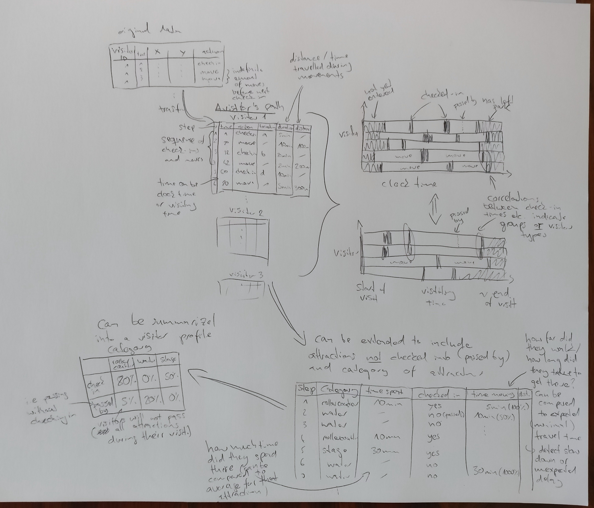

## Visualization Sketches

The next step to visualizing the park data is to make some sketches of possible visualizations. The point is to do a lot of them, fast, and without being too critical (at least for now). I found it quite difficult to move from idea to idea quickly. Mike Bostock’s talk on [design as a search problem](https://www.youtube.com/watch?v=fThhbt23SGM) was mentioned in the class — I’m definitely more of a *depth-first* searcher by nature. I see the point of being more *breadth-first*, though, and it’s fun to try to push myself into that direction (albeit not yet very succesfully).

I didn’t bother to sketch any of the more obvious visualizations (e.g. bar plots of visitor numbers…) because I find the less simple visualizations more intriguing and I really hope to do something unusual for this course. This could be a mistake, because sometimes the more interesting ideas are easier to get to if you approach them in little steps. This is something I noticed when doing this exercise, and it was also mentioned in the course and in Bostock’s talk, I believe. Then again, there is only so much time I can spare.

I also didn’t bother with sketching maps, because I have already visualized the maps for the first blog post and I don’t really want to make a “geographical” visualization for the project. I find the exact location more of a nuisance variable that adds noise to the truly interesting information. I’d rather “abstract it away” somehow, and I explored some ways to do this (e.g. by using “transitional probabilities” between locations).

Anyways, enough talk. Here are my sketches:

  

_This was more of a reminder of what the data structure could look like than a visualization sketch._

  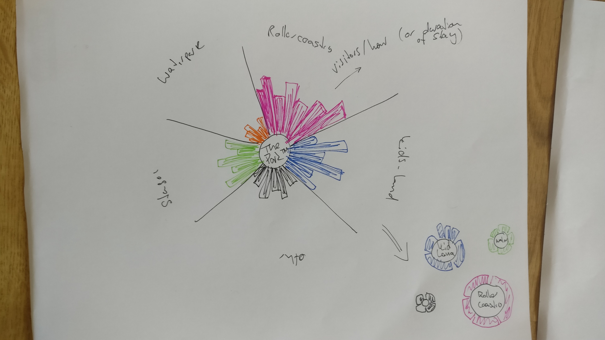

_Some simple plots that show the average hourly visitor numbers (or some other attraction-related statistic of choice) for all attractions in the park, color-coding different areas. I’m surely using too many circles in all my sketches. It looks nicer, but a bar plot would likely be better in many cases._

  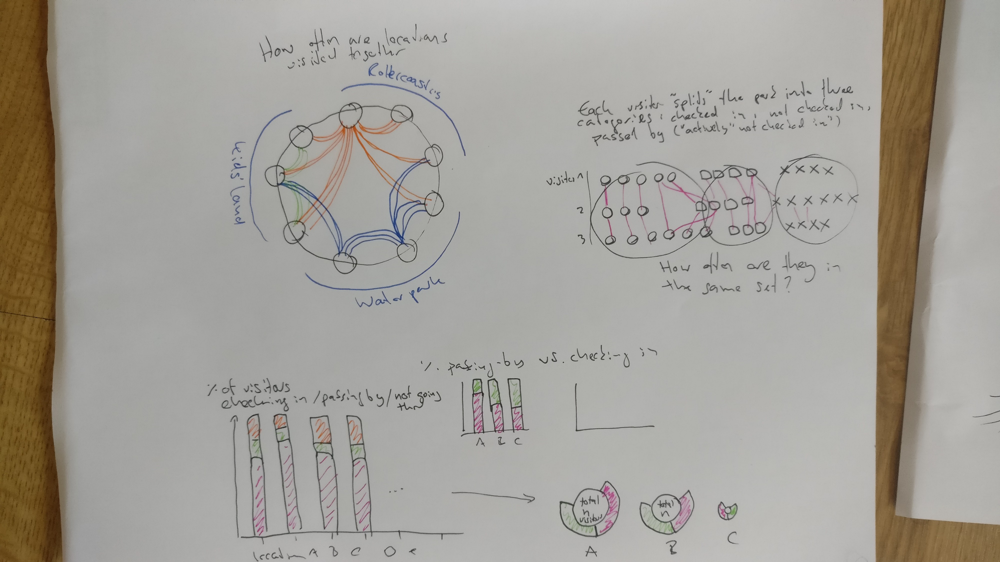

_**Top left:** for all attractions, which other attractions did the visitors go to? **Top right:** I was trying to wrap my head around the three different ways that visitors interact with attractions in the park. Not really a visualization sketch. **Bottom:** For each attraction, how many people passed by, checked in, never went there?_

  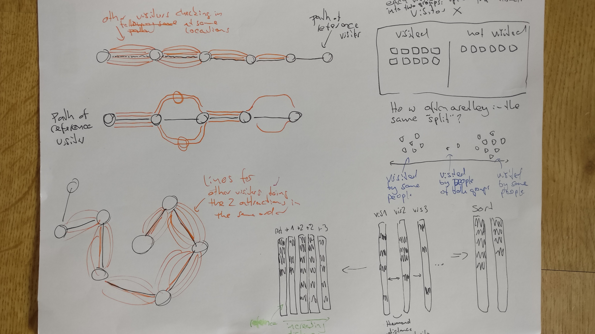

_**Left (orange):** can we show a visitors path through the park and contrast it against other wisitors paths? **Right:** I realized that for any two visitors check-in/no-check-in profile, we can define the [Hamming distance](https://en.wikipedia.org/wiki/Hamming_distance). This means we can find identical profiles, profiles with 1 (2, 3, … n) differences._

  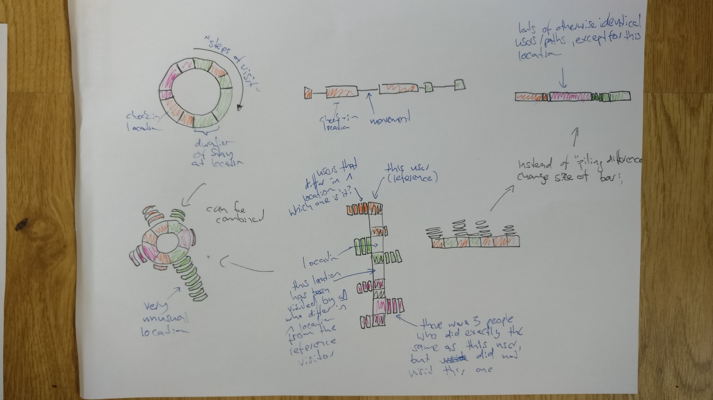

_Here I’m mostly expanding on the idea with the Hamming distance. Can we show the way that other “almost identical” visitors are different. Might be a good way to detect unusual patterns._

  

_Between any two check-in locations there is a transitional probability (and for longer sequences of check-in locations we could define the n-gram probability using Markov chains). Can we use this to find people who take very uncommon paths through the park?_

  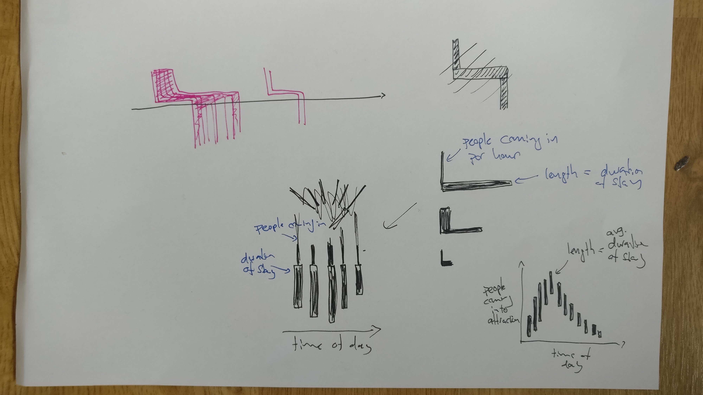

_I was trying to find a way to show when people check into a location, how many check in, and for how long they stay. I first tried some fancy glyphs (the angular and toilet brush shaped things). But in the end I found the scatter plot with bars (bottom right) the clearest way to do it._

  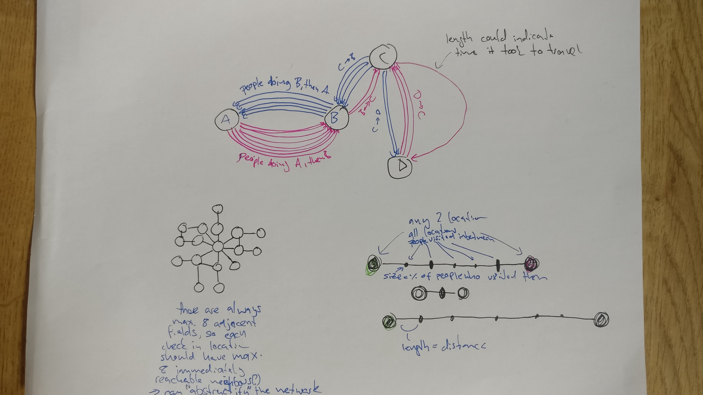

_**Top:** This is similar to some of the previous sketches. we can show how many people travel between any two locations, in which direction, and how long they take (relative to each other). **Bottom right:** The line shows the path between two locations. On the way there may be other locations (smaller black bars). The size of these show how many (proportion) of the people who went from A to B stopped at that inbetween location. Instead of circles little squares / bars could work well for this. Showing the path (line)._

  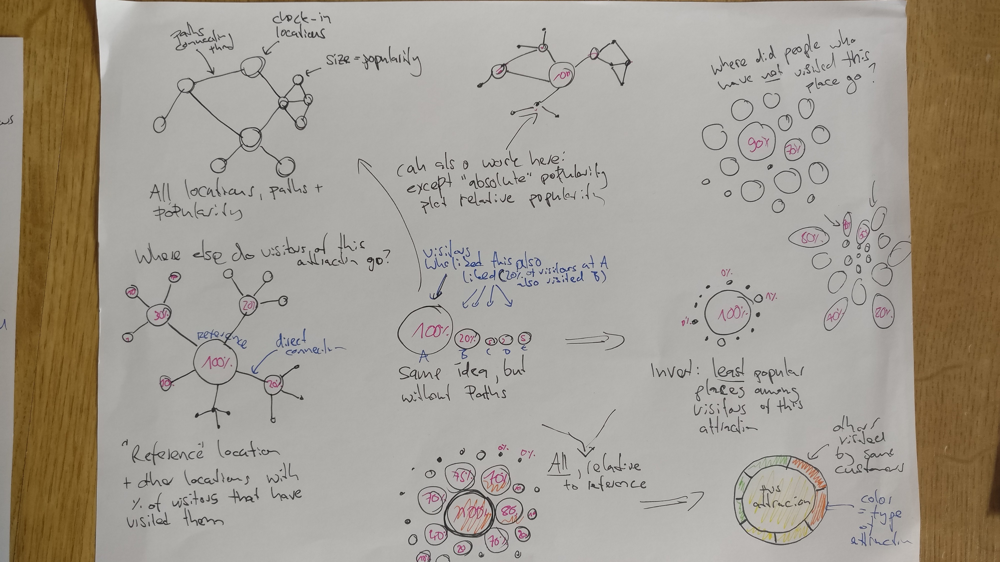

_Most of this is similar to the bottom right one above. There is a reference location (marked with “100%”). We want to know which other locations the visitors of this reference attraction have visited (or not visited!). The idea is similar to Amazon’s “Customers who bought this also bought…”, but it’s also showin you how many of them did so._

  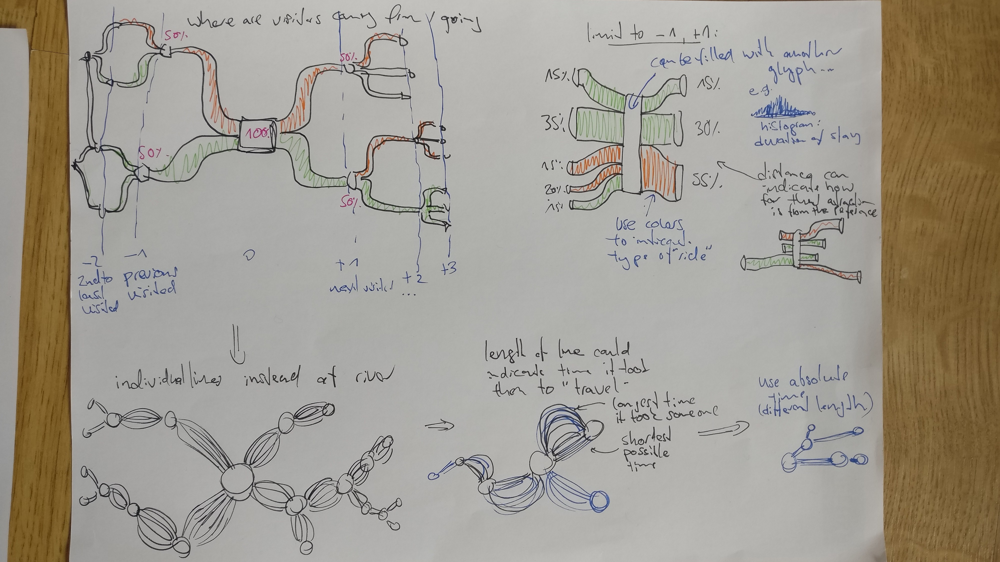

_Here I played with the idea of river plots (I believe that’s what they are called). They show the flow of visitors to and from the reference location. You can see which attractions they come from, and where they go afterwards. We could plot just the previous and next steps of their journey (top right), or multiple steps (top left)._

  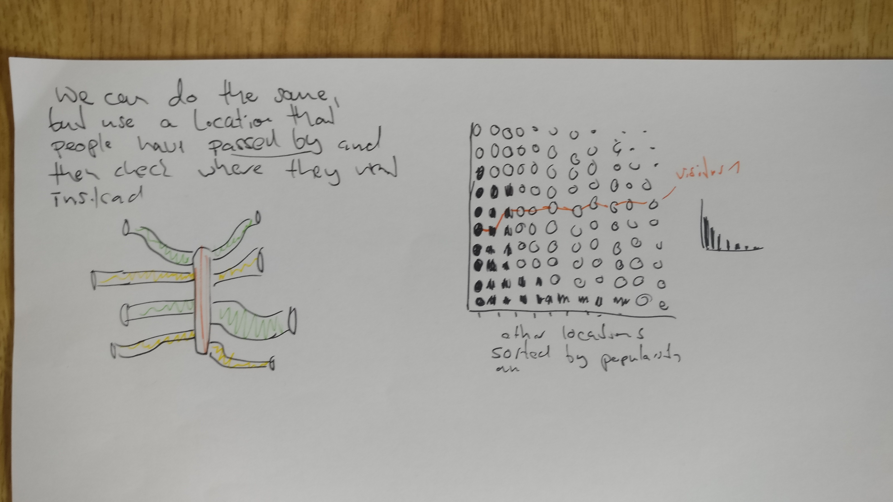

_**Left:** continuation of above. **Right:** Maybe someone can explain to me what I was trying to do here?_

  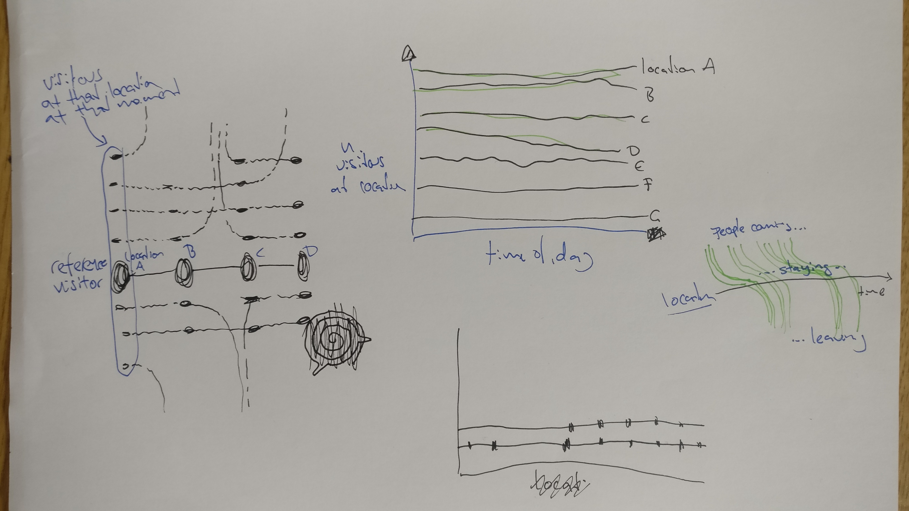

_These are mostly variations on ideas I’ve already sketched elsewhere._

  

_I was trying to show where in the park visitors are, and how that changes throughout the day. I am a bit fond of the “solar system” idea in the bottom left. It’s a circular bar plot, where each circle is an attraction and the bars show the number of visitors around the clock. The larger a circle, the more visitors in total._

  

_The **top left** shows a visitors’ path from location to location. the horizontal distance is the time they traveled, the vertical distance is the distance thy traveled. Both could be normalized to the expected (e.g. average) time/distance for traveling between the two locations. The **bottom** one is similar to the area plot in the previous sketch._

## Final Visualization Sketches

This week’s assignement for the visualization course was to make a final round of paper sketches.

### Crooked Paths — Visualizing Visitor’s paths
The idea is to show individual visitors’ paths in a way that makes unusual paths easy to spot (i.e. making it a relatively simple “perceptual task”). I thought that transitional probabilities could be the key to such a visualization. **Transitional probabilities** can be assigned to the the transition between any two check-in locations, based on the number of visitors checking in at them in that order, _p(B|A)_, relative to those who instead go to another location, _p(not B|A)_. By translating the probability of transitions between check-ins into angles, unlikely paths will appear crooked.

Paths can be sorted according to their crookedness, too. Other types of clustering can be used, as well, e.g. based on Hamming distance (see below). Clusters could also be shown separately, and transitional probabilities could be calculated per cluster rather than overall.

  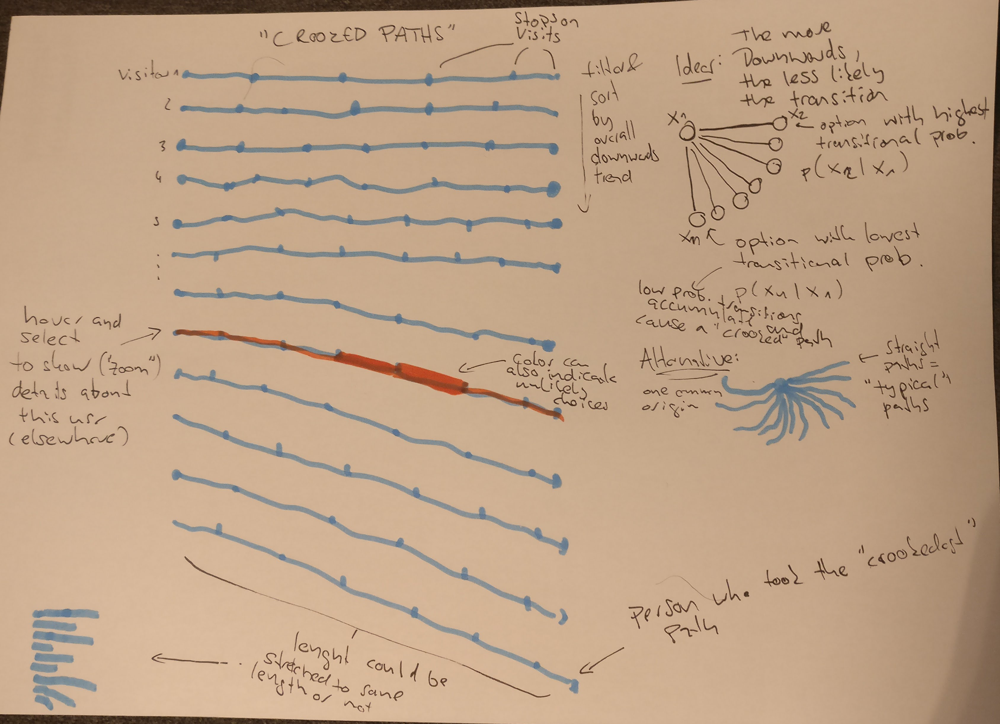

_Hovering should highligh an individual path. When a path is selected, additional detail / plots for this visitor can be displayed (not shown)._

Instead of length of all paths being equal, one could encode other information in the length, such as the time it took to travel between the location or the distance traveled. Alternatively, keeping each individual check-in segment at the same length, people who have more checkins will stand out more. Filtering (or highlighting) by length is also an option and could be realized with simple mouse interactions (e.g. horizontal position of the mouse filters paths of certain lenghts).

Alternatively, probability of transitions could be encoded in the width of the line, as shown below. This might have the advantage that paths will not overlap. However, I have a feeling that the option above is visually more appealing, and I like the analogy with _“crooked paths”._

  

The idea could be extended using the probabilities of longer chains, i.e. n-grams / Markov chains, rather than simple transitional probabilites between two locations (i.e. _1_-grams). For a first atempt, this seems unnecessary.

### Flagging “Mutations” in visitor DNA

As shown in a previous blog post, we can divide a visitors path into visited and unvisited locations — basically a vector of 0's and 1’s. For each visitor we can then find visitors who have the same vector *except* for one location (a **Hamming distance** of 1). This information can be used to see with regards to which locations a visitors path stands out from the rest.

The Hamming distance can also be used for clustering visitors, which could be useful to add some order / filtering to the plots (including the rooked paths plot above).

  

_Instead of highlighting “unusual” check-in locations, one could just color code the number of check-ins at that location. Some visitors may stand out quite a bit if we do that._

### Visualizing Visitors at Rides: Overview

The main goal of visualizing rides is to detect (unusual) patterns of visitors coming and going.

One useful plot would be some sort of overview of all locations over time. I don’t like to show the locations and paths on a map, because their exact geographic location seems irrelevant, and maps leave a lot of unused negative space. Instead I was thinking of arranging them as tiles (see below), rougly sorted by proximity. Then changes in time can be visualized as sort of a heatmap.

The paths between locations can be summarized as tiles as well, because we always know where people are coming from and where they are heading to, i.e. which path they are on.

  

Instead of using a grid, one could lay out the locations/paths in a slightly less rigid way that still reflects geographial proximity or some other kind of similarity. This allows other ways of encoding information besides hue/saturation:

  

_the locations are represented as lines. The Visitor activity is coded as ares, which is slightly more salient than hue/saturation used in the heatmap above._

  

_Clusters of attractions are shown as circles made of circles, like a pearl necklace. The size of the large (necklace) and small (pearls) changes as a result of visitor activity. If nothing is highlighted it will look like a long motion blur / multiple exposure and should give an idea of the overall change. By using the mouse, individual moments in time can be highlighted._

### Visualizing Visitors at Rides: Details

For a more detailed view of the activity at the rides it should be possible to work with small multiples. There are three plots I thought could be useful:

- The top one shows the number of vistors and the duration of their stay throughout the day(s)
- The midle one shows how many visitors check-in at each time. Different sizes for the rolling average window are displayed at the same time to allow the detection of long term patterns and short term patterns.
- The botom plot shows where visitors are coming from and going to at each moment in time. By adding some simple interactivity one could find times where unusual things are happening. This likely is too complex or small multiples, but it’s definitely somethin I’d like to try.

  

The plot below shows where else the visitors from a certain ride are also going (and how far these locations are from it). To some extend this could be incorporated in the third plot above.

  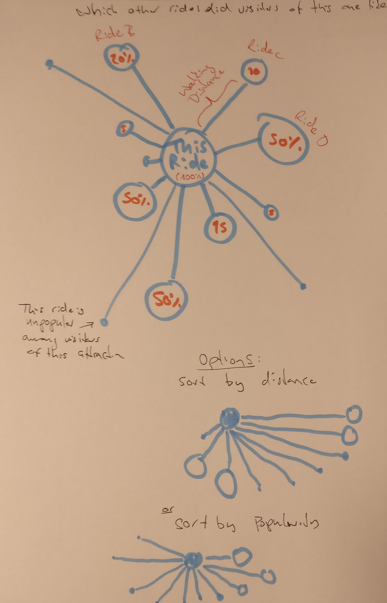

These are some ideas I definitely want to try out. There are some simpler plots (histograms and the like) that could be added around them to add more information.

## Preparing Data for the Visualization

  

_The check-in locations in the park with the IDs and categories corresponding to the the map. Note that not all locations can be checked in to (cf. full list of categories on the right)._

To prepare the park data for the visualization some data preparation is necessary. One thing I have done is to figure out the IDs, names and categories of all check-in locations. I also made a distance matrix for walking distance between all check-in locations and some smaller things.

I thought that some of it could be useful to other course participants, so [I’ve put the code on Github](https://github.com/Teebusch/datavis-course). Instructions and details can be found there. The code is heavily commented, but if there are any questions, I’d be happy to help. Also if anything seems odd, let me know and I will check it. It’s not unlikely that I made a mistake (it should also go without saying that this is “use at your own risk”).

## Sketching in R -- Crooked Paths

I tried to build some of the visualizations I had in mind for the park data in R. With ggplot it’s easy to try out ideas quickly and detect problems. I started with the crooked paths visualization, in which the “regularity” of each visitor’s path through the park is shown, so that unusual paths can be detected. For this I calculated **transitional probabilities** for each sequence of two check-ins (How likely is it that someone checks in at location B after they visited A?). These probabilities are normalized for each check-in location and translated into an angle (0–180 degree) and a hue. **The brighter and more “downward pointing” a line segment is, the lower the transitional probability.**

There are over 17.000 paths in the data set, so some kind of filtering or faceting is needed. For now I’ve split the paths by the number of check-ins. I also **randomly sampled 3000 visitors** to spare my laptop some pain. Here’s what the sketch looks like:

  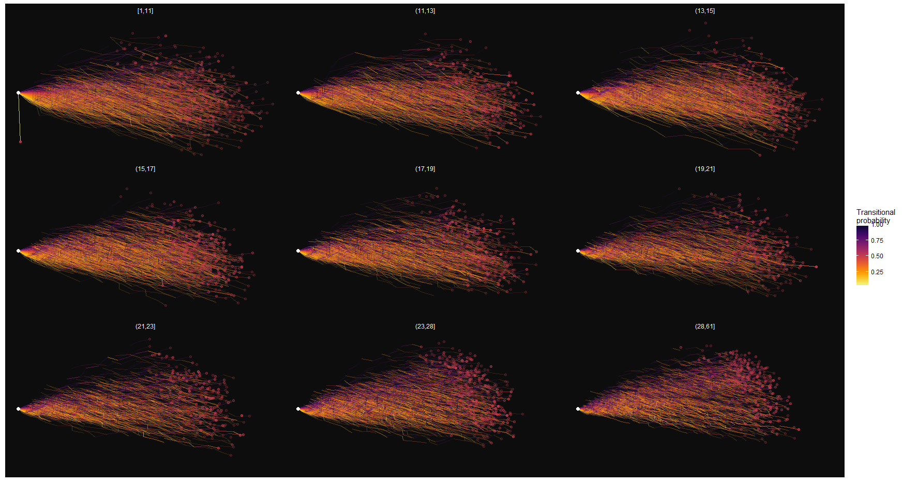

It’s obvious that showing too many paths at the same time will not work. In the actual visualization the number of paths shown should be limited through some kind of filtering.

In the plot below I’m showing just 200 paths divided over different buckets. The further to the right a line segment points, the lower the transitional probability. The small number works much better for detecting interesting paths. It’s still quite crowded, though, and interactivity with brushing and highlighting will be key to make this work.

  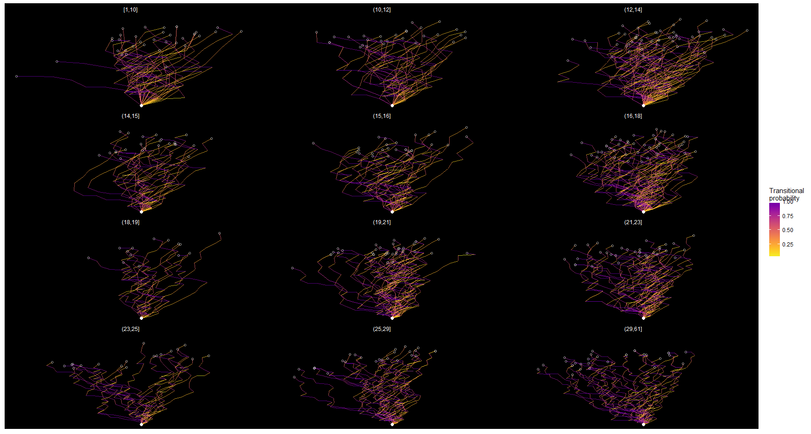

One way to make it easier to spot strange paths is to offset the individual path’s starting points a bit, and sort them according to their “crookedness”. This can be seen below. In this case I’m sorting them by their average displacement. The nice thing about this is that the line ends (white dots) double as a scatter plot with the “crookedness” mapped on the horizontal axis and the length of the path on the vertical axis. This can help to spot ouliers (say, short but very crooked paths).

  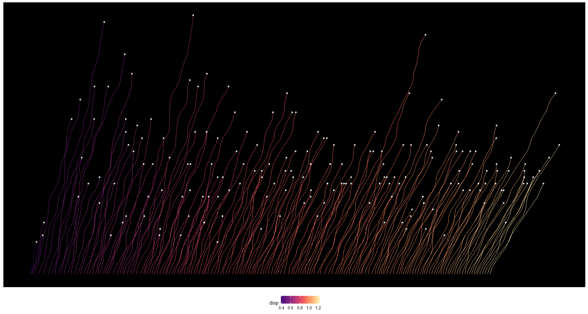

Instead of allowing the paths to “recover” from their crookedness, we can also accumulate it. For every unusual transition, the path gets slightly more bent to the right. This gives us a plot like the one below.

  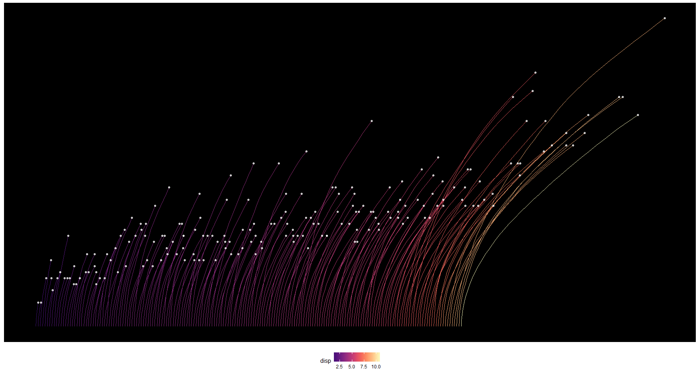

In general, I am not 100% satisfied with this idea. It looks visually pleasing and it could help to detect some outliers, but it does not accomodate the many data points and it does not work great as a data display. I’m sure it can still be improved, and I will think about how to do that.

## Sketching in R -- Coming and Going

Here’s another visualization of the park data I’m working on. It shows **people checking in and leaving different locations.** Each subplot is one location. Every line represents a visitor entering (lines on top) or leaving it (lines on bottom). The small circles in the center indicate the *number of checked in visitors* per 15 minute time window. The hue shows *how long* the visitors stay.

  

_Visitors entering and leaving different locations on Friday. It looks a bit like hair color samples. (Note: the dots in the center don’t work as they are supposed to, yet, but it’s just a sketch anyways.)_

It’s possible to spot patterns and differences between locations. See for example the *SabreTooth Theatre* (2nd row from the bottom, 2nd plot from the left): people are entering almost continuously, but leaving in large groups in regular intervals. I imagine people wait around for the show to begin and then leave quickly once it is over. A similar pattern can be seen for the *Scholtz Express* (two to the right) — probably a train that takes in a large group of people at a time and spits them out ~10 minutes later.

However, there is a lot of fine tuning needed to really make this visualization work:

- **The hue doesn’t work that well,** because the distribution of the duration is heavily right-skewed. Some transformation might help. However the lines being translucent and overlaying each other also muddles the color-coding.
- **The dots in the center overlap too much.** It’s not really possible to read any useful information from them. As an alternative I put a bar plot in the center (see below). This works better to show the summary data, but obscures the line endings a lot. Maybe it is something for the detail view?
- **The plot takes a few minutes to draw.** It’s a lot of data (more than 16.000 curves for Friday alone). As an svg file it is almost 200 Mb large. That means that some compromise is necessary to make this work as an interactive visualization. There are lots of overlapping lines — maybe it’s possible to reduce or summarize them?
- **The subplots are arranged haphazardly.** Arranging them by location- category, total number of visitors, proximity or similar would make sense.

  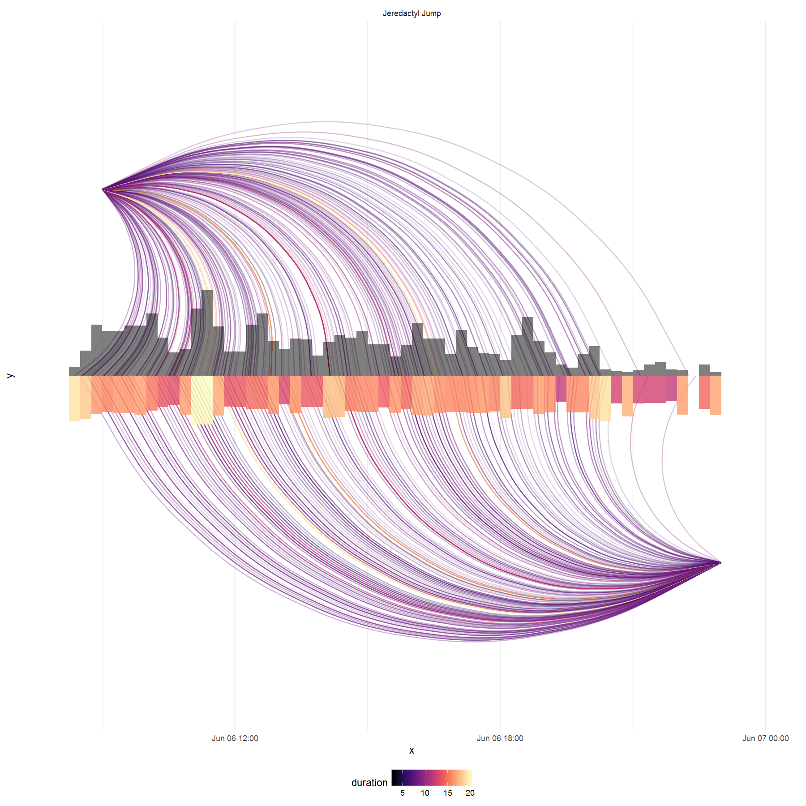

_The same “glyph”, but with bars rather than dots in the center. The top row indicates number of checked in visitors, the bottom row indicates median duration of stay. (Yes, the color scales of the lines and the bars don’t match.)_

### Adding Interactivity

A plot with small multiples like the one above serves as a good **overview.** Selecting an individual location could then reveal a **detailed view.**

In the detail view the visitors’ lines could be separated by where they are coming from and going to. The user could then choose to *highlight all connections with specific locations* by hovering over the points in the center or at the edges. One could then, for example, see which ride people are coming from when they check into *Liggement Fix-Me-Up* (the medical station, I presume). This could tell us which rides cause the most injuries. A static version of the detail plot can be seen below:

  

There are some improvements that can be made to the detail plot:

- **Make it interactive**
- **Position, sort, size and color** the dots at the top and bottom to show the location’s category, total contribution of visitors, proximity to each other, or distance to the selected location. Of course the dots should also be labeled.
- **Again, it takes quite long to draw the plot.** Not as long as for the plot above, but likely too long to make the interaction feel smooth.
- **Currently, there is no location id for “not in the park”.** I believe the rows where people just entered the park or leave it afterwards are simply being dropped (not shown) by ggplot. This must be fixed.

I’m much happier with this visualization than with the crooked paths. It looks nice, works good for detecting patterns and can pack a lot of information. The main challenge will be to make this interactive.

## Final Visualization with D3.js

Here’s the final result. You can try it yourself at <https://teebusch.github.io/park-vis/.>

You can also inspect the source code (including all the R code for data munging and sketching) on [Github](https://github.com/Teebusch/park-vis).

We worked with a data set of visitor movements through a (simulated) amusement park. Over the course of a weekend each visitor’s position in the park and their use of the various attractions (rides, shows etc.) was tracked. There are more than 26 million records. The data contains traces of disturbances in park operations and interesting patterns for us to discover.

  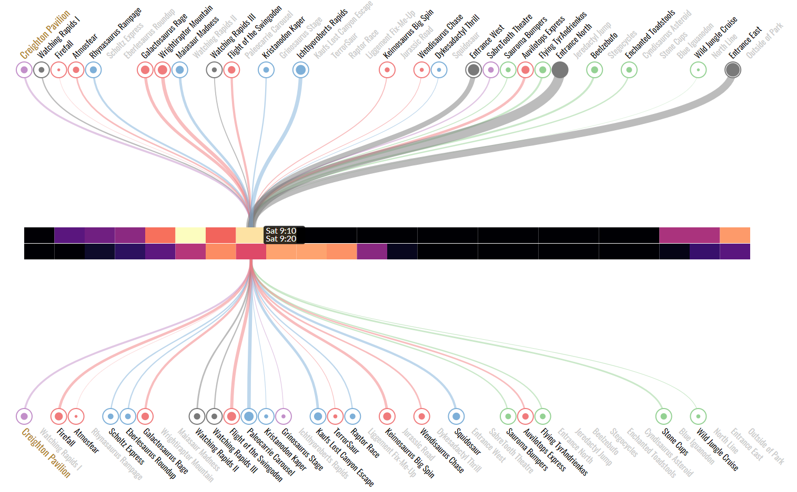

We had to go through all the steps of defining and implementing a visualization project. The goal of the assignment was open-ended. A personal goal of mine was to get more into D3.js and create a customized, truly interactive data visualizations.

### Concept

After multiple rounds of sketching on paper and in R I decided to visualize the **visitor flow between the different attractions** in the park, and the way it changes over time. The visualization should not lead up to a single conclusion but rather allow the user to explore the data freely, while making it easy to spot unusual events and patterns. A visualization like this could be useful, for example, for park management.

### Implementation

When I used R to implement my idea with real data, it became clear that there were some interesting patterns. However, for the visualization to really work, the interface had to be more responsive and interactive than what ggplot and Shiny could do — D3 to the rescue!

A while ago I had read Scott Murray’s **“Interactive Data Visualization for the Web”** and followed a beginner’s D3 course on Lynda.com. To get a more in-depth understanding of D3 I picked up Elijah Meeks’ **“D3.js in Action”.**

Some examples of insights gained from the visualization are provided in the figures below.

  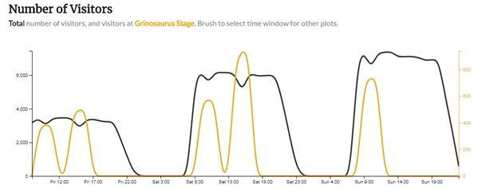

_Total number of visitors in park and at Grinosaurus stage throughout the 3 days. It’s easy to see that the second one of the bi-daily show did not take place on Sunday. Also: the second show on both Friday and Sunday seems to be more popular, even though the number of visitors in the park is the same._

  

_Example: Visitor flow to/from Liggement Fix-Me-Up. Most people who need “fixing up” come from the Firefall and Atmosfear thrill rides. Interestingly, most people who have just been fixed up go right back to one of the thrill rides. There also seems to be a strong peak in accidents on Friday._

### Limitations

Due to time constraints and the steep learning curve of D3, some features could not be implemented before the submission deadline of the asgignment. Most unfortunately, the final implementation does not contain a “small multiples” view of all locations with their visitor number and check-in durations, as sketched in R. This would be a very useful addition to the interface, to help the user get an overview before “drilling down”. Legends for heat maps and circle sizes are missing, too.

However, I won’t add to it anymore. I’ve learned a lot doing this project, but there is a diminishing return. There’s a lot more to learn about designing and implementing visualizations. In particular the early sketching and conceptualizing — getting from a data set to a visualization idea — is something that needs a lot of practice. It’s better to look for a new challenge.

***

Do you like the visualization? Did it make you hungry for a plate of colorful spaghetti? Tell me about it! [@drtobilotti](https://twitter.com/drtobilotti)