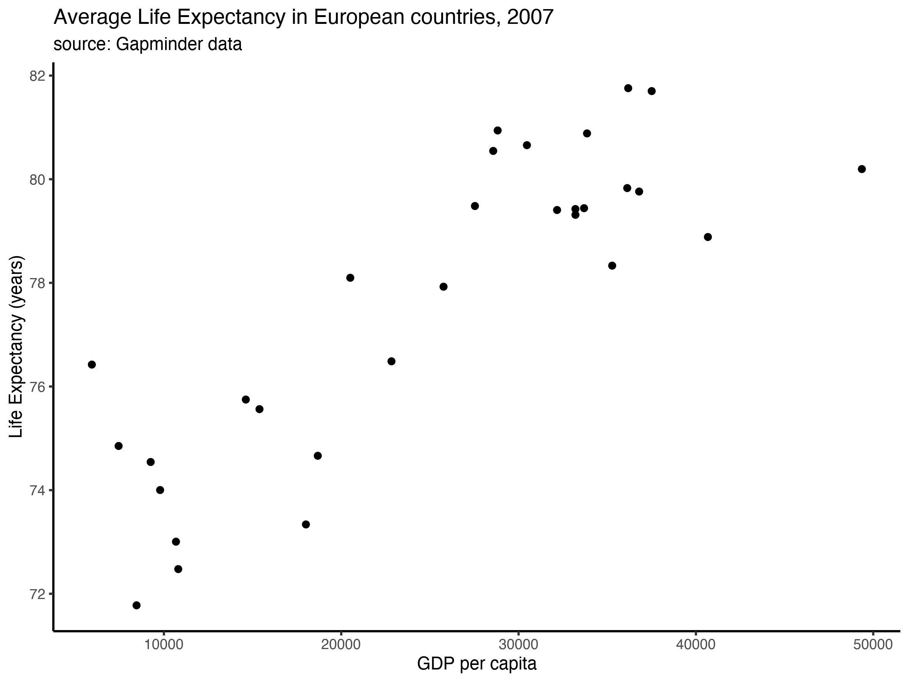
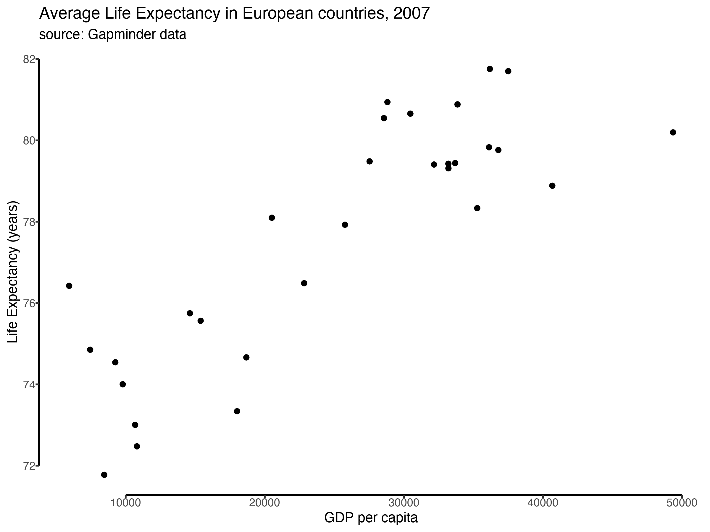
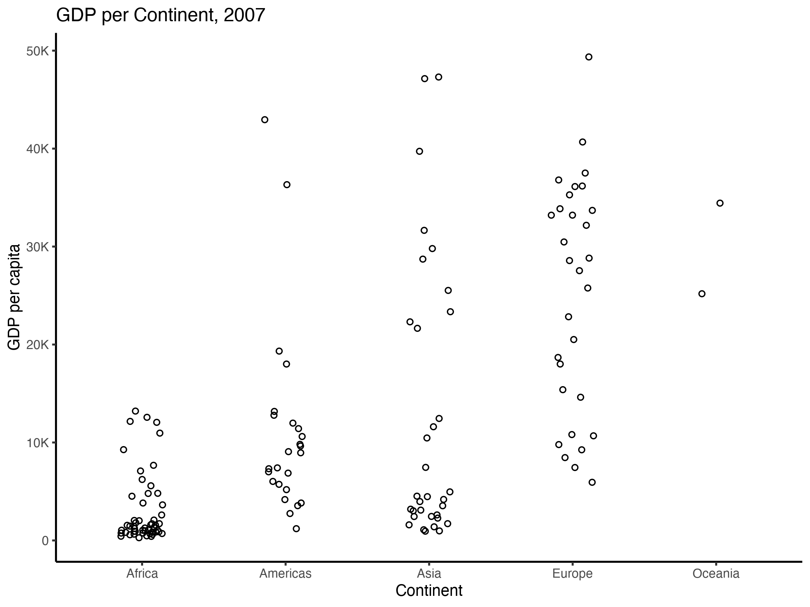
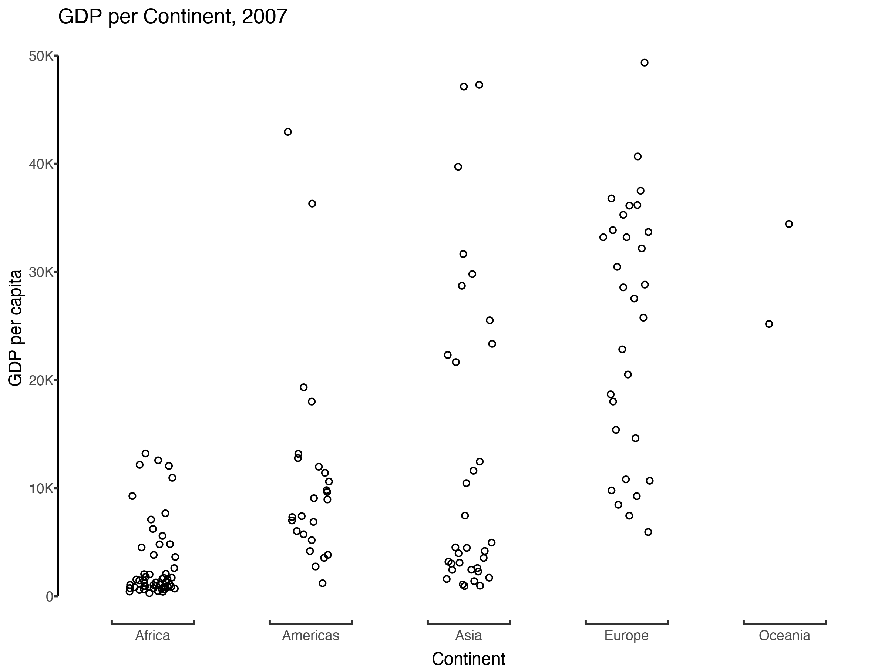
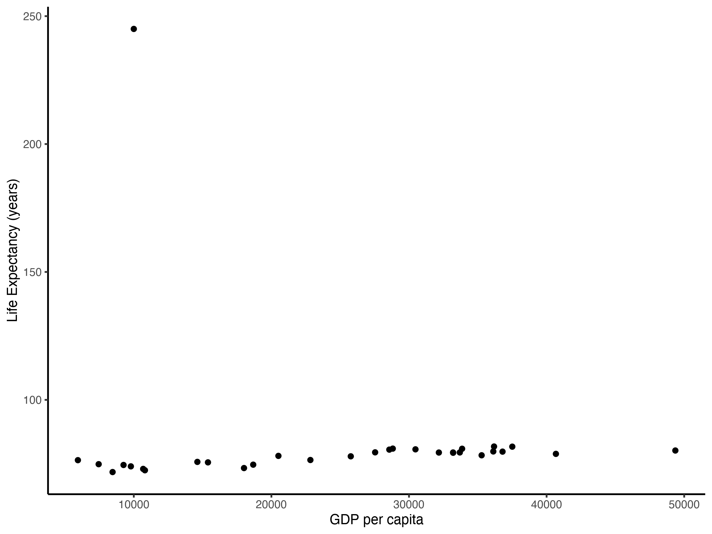
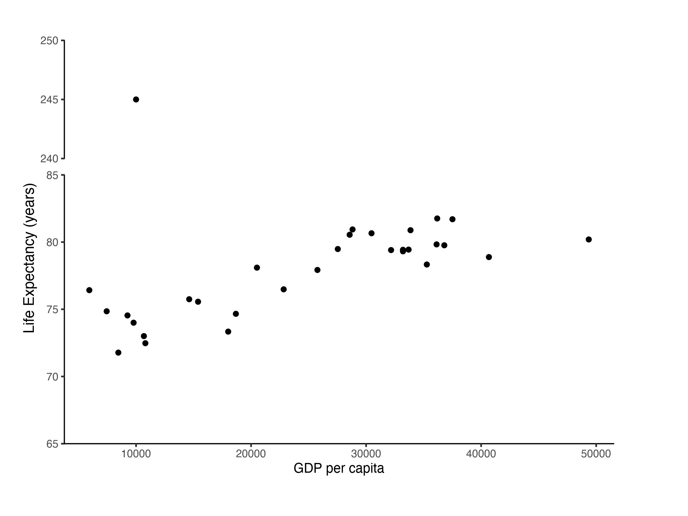
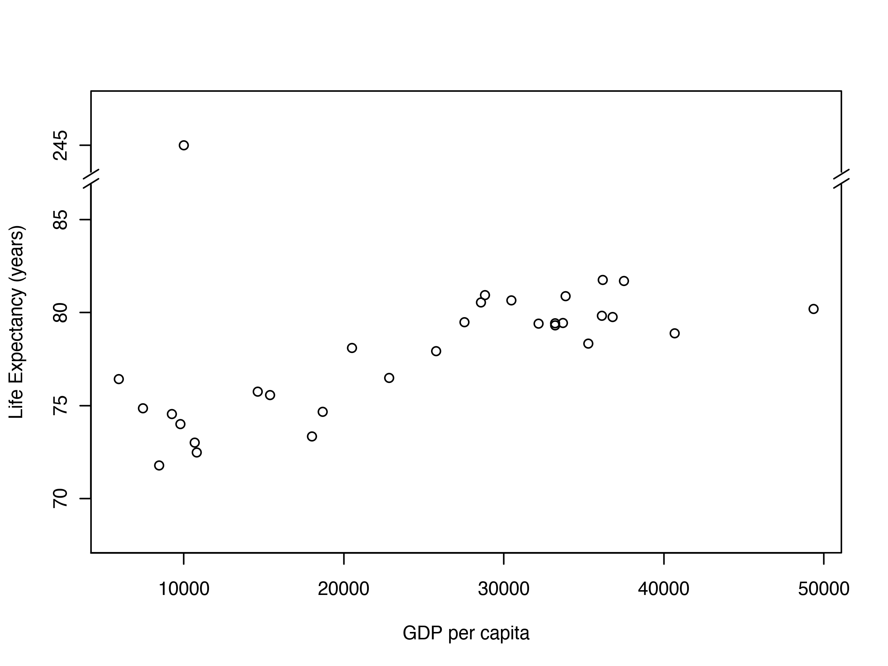

## There's an R package for that!

There are over 15.000 packages on [CRAN](https://cran.r-project.org/), the R package repository, and many more on GitHub and other places. Some will make your life easier, some will make you scratch your head in wonder. In this series of blog posts we have a look around the R package ecosystem. Each episode highlights another package, demonstrating the power of R and its amazing community.

------------------------------------------------------------------------

## Mind the Gap!

If you want to add a gap to a figure's axis, you are probably looking for one of three things:

-   **Capped axes** -- Look good when using continuous variables that don't start at 0.
-   **Bracketed axes** -- Look nice when plotting discrete variables.
-   **Discontinuous axes** -- Good for showing outliers without squishing all other data.

## Capped axis

Here's a simple plot, using ggplot and `theme_classic()`

``` python
library(tidyverse)

if(!require(gapminder)) install.packages("gapminder")
data(gapminder, package = "gapminder")

df <- gapminder %>% 
  filter(continent == "Europe", year == 2007)

p <- df %>% 
  ggplot(aes(gdpPercap, lifeExp)) +
  geom_point() +
  labs(
    x = "GDP per capita", 
    y = "Life Expextancy (years)", 
    title = "Average Life Expectancy in European countries, 2007",
    subtitle = "source: Gapminder data"
  ) +
  theme_classic()

p
```



I'd argue that the joint axis lines at the origin (i.e., in the corner on the bottom left) are not great: The two scales (GDP and Life Expectancy) are measured in very different units, and the values do not include zero. Indeed, the fact that the values are far from zero already tells us something about life in Europe, so why don't we highlight this more?

Unfortunately, `ggplot` does not come with a theme where the axis lines are not joined at the origin. Luckily for us, there's `lemon` -- *"a package to freshen up your ggplots!"*. Here's how it works:

``` python
if(!require(lemon)) install.packages("lemon")
library(lemon)

p + lemon::coord_capped_cart(bottom = 'both', left = 'both')
```



By default, the axes may be capped at a weird point. For more control, you can specify the axis ticks manually:

``` python
p + 
  lemon::coord_capped_cart(bottom = 'both', left = 'both') +
  scale_x_continuous(
    breaks = seq(5000, 50000, 5000), 
    labels = scales::label_number_si()
  )
```


**Note:** You have to get rid of the panel border and axis lines to see the effect. If you are not using `theme_classic()` this can be achieved by adjusting the theme of the plot like this...

``` python
p + 
theme(
  panel.border = element_blank(),
  axis.line    = element_line()
)
```

## Bracketed axes

You can also use `lemon` to make bracketed axes. These look good when you are plotting discrete variables. So instead of this...

``` python
df <- gapminder %>%
  filter(year == 2007)

p <- df %>% 
  ggplot(aes(continent, gdpPercap)) + 
  geom_jitter(width = 0.15, shape = 1) + 
  scale_y_continuous(label = scales::label_number_si()) +
  labs(title = "GDP per Continent, 2007", x = "Continent", y = "GDP per capita") +
  theme_classic()

p
```



...you get this:

``` python
p +
  lemon::coord_flex_cart(bottom = brackets_horisontal(), left = capped_vertical('both')) +
  theme(
    axis.text.x  = element_text(vjust = -1),  # the labels are a bit too close to the brackets
    axis.title.x = element_text(vjust = -2)
  )
```



The bracketing helps to emphasise that the variable on the x-axis (continent) is a discrete variable, and to visually separate the jittered points belonging to each continent.

You can learn more about `lemon` [here](https://cran.r-project.org/web/packages/lemon/vignettes/capped-axes.html). For an alternative solution using ggplot-trickery, see [this Stackoverflow answer.](https://stackoverflow.com/a/25327902)

## Discontinuous axes

So far we have only removed parts of the axis *lines*, leaving the data points where they are in the figure. Sometimes we'd like to skip sections of the coordinate system, for example to show outliers without having to squish together all other data points. To demonstrate this, I will add an outlier to the data:

``` python
df <- gapminder %>% 
  filter(continent == "Europe", year == 2007) %>% 
  add_case(country = "Shangri-La", gdpPercap = 10000, lifeExp = 245)

p <- df %>% 
  ggplot(aes(gdpPercap, lifeExp)) +
  geom_point() +
  labs(
    x = "GDP per capita", 
    y = "Life Expextancy (years)"
  ) + 
  theme_classic()

p 
```



This is bad! The outlier makes it very difficult to tell the difference in life expectancy between all the other data points. In a case like this, a log-transformation can often help to stretch out the data points with lower values while bringing those with higher values closer to them. Here a log-transformation would not help much and it would make the units harder to interpret -- *log life expectancy in years* instead of *life expectancy in years*.

Instead, it might be better to skip a range of values along the axis. You just have to make sure that the reader understands that this is what you are doing, so you don't unintentionally mislead them.

To skip a range of values on the y-axis you can use the `gg.gap` package, which you can find on CRAN and [here](https://github.com/ChrisLou-bioinfo/gg.gap). It works like this:

``` python
if(!require(gg.gap)) install.packages("gg.gap")
library(gg.gap)

# we need to tweak the theme a bit to make it look nice
# and we need to do it before we pass the plot to gg.gap
p <- p +
  theme(
    panel.background = element_rect(fill = "white"), 
    panel.grid = element_blank(),
    axis.line = element_blank()
  )

p %>% 
  gg.gap::gg.gap(
    ylim = c(65, 250), 
    segments = list(c(85, 240)),
    tick_width = 5,
    c(0.7,0,0.3)
  )
```



To me, `gg.gap` feels a bit fiddly and the documentation is not very clear. If you don't mind using base R graphics instead (thus, losing the power of the grammar of graphics), the `plotrix` package might offer a better alternative:

``` python
if(!require(plotrix)) install.packages("plotrix")
library(plotrix)

plotrix::gap.plot(
  x = df$gdpPercap, 
  y = df$lifeExp, 
  gap = c(87, 243), 
  breakcol = "white", 
  xlab = "GDP per capita", 
  ylab = "life Expectancy",
  ytics = c(70, 75, 80, 85, 245),
  ylim = c(68, 247)
)

# decorate the gaps with diagonal slashes
plotrix::axis.break(2, 87.2, breakcol="black", style="slash")
plotrix::axis.break(4, 87.2, breakcol="black", style="slash")
```



------------------------------------------------------------------------

Has this blog post helped you? Do you know other packages that remove things which don't spark joy? Tell me about it! \[@drtobilotti\](<https://twitter.com/drtobilotti>)

